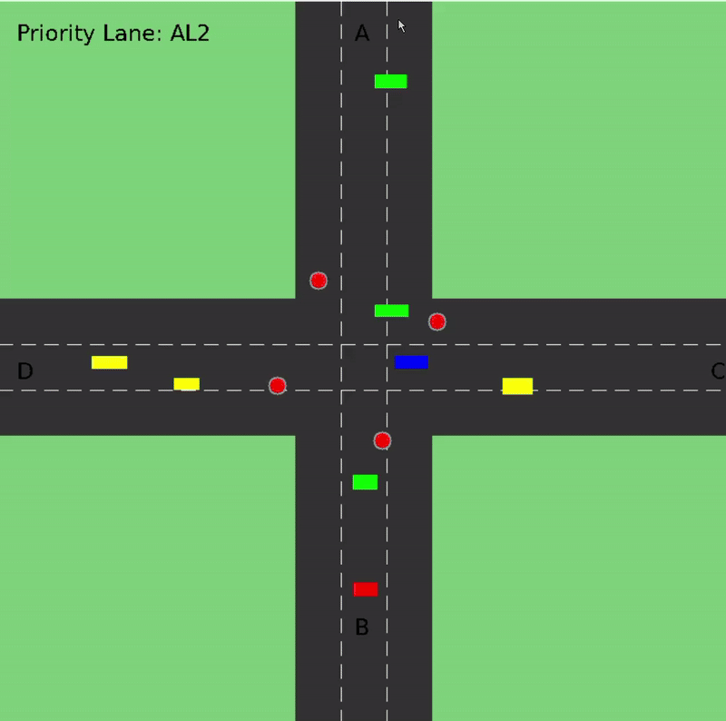

# **Traffic Queue Simulator Project**
#### Assignment #1 - Implementing Queue for solving the traffic light problem

Name: Asmi Baidya 

Roll Number: 05 

Date: 27th Dec 2025

---

### **Introduction**

This project involves the design and implementation of a traffic management system simulating a four-way intersection. The system generates vehicles with unique identifiers, assigns them randomly to lanes, and manages vehicle queues for each road. Traffic lights operate in a round-robin fashion with a priority mechanism to optimize flow, especially for heavily congested lanes. The system uses SDL2 for visualization and file-based communication for modular data exchange. Threading and mutexes ensure safe concurrent operations.

---

### **System Architecture**

The system is divided into four main modules:

• Simulator (simulator.c, simulator.h): Handles rendering, queue management, traffic light logic, and vehicle sprite animation.
• Receiver (receiver.c, receiver.h): Monitors the shared file (vehicles.data) for new vehicle entries and parses them into lane-specific queues.
• Traffic Generator (traffic\_generator.c, traffic\_generator.h): Randomly generates vehicles and assigns them to lanes, writing them to the shared file and enqueuing them.
• Shared Data Structures: Defines queues, vehicle structures, and synchronization primitives (mutexes).

---

### **Data Structure**

Data Structure	Implementation	Purpose
VehicleQueue	Linked list with mutex	Stores vehicles in each lane queue safely
Vehicle	Struct with ID and lane	Represents individual vehicles
SharedData	Struct with mutex	Holds traffic light state and timing info

---

### **Key Features**

1\. Vehicle Queues

•	Each road (A, B, C, D) has a dedicated queue (VehicleQueue).
•	Functions implemented:
o	enqueue() and dequeue() for adding/removing vehicles.
o	queueSize() for monitoring queue lengths.
•	Mutexes ensure thread-safe access to queues.

2\. Traffic Light Control

•	Lights cycle through roads in a round-robin fashion.
•	Priority is given to Road A when its queue exceeds 10 vehicles.
•	SharedData structure tracks:
o	Current and next light.
o	Last served vehicle count.
o	Green light duration and remaining time.

3\. Vehicle Generation

•	Vehicles are assigned random alphanumeric identifiers.
•	Random lane assignment ensures balanced traffic.
•	Vehicles are written to vehicles.data and enqueued directly.

4\. Receiver Module

•	Continuously monitors vehicles.data.
•	Parses entries in the format VehicleNumber:Lane.
•	Outputs received vehicles to the console.

5\. SDL2 Visualization

•	Roads and lanes are drawn using SDL2 rendering.
•	Vehicles are represented as colored rectangles with headlights and taillights.
•	Traffic lights and countdown bars visually indicate active lanes.
•	HUD displays queue sizes and priority status.

---

### **Threading Model**

The system uses SDL threads for concurrency:

•	Queue Thread: Manages traffic light logic and dequeues vehicles.
•	File Thread: Reads lane-specific files and updates queues.
•	Receiver Thread: Monitors vehicles.data for new entries.
•	Traffic Generator Thread: Continuously generates vehicles.

Mutexes (SDL\_mutex) ensure safe concurrent access to queues.

---

### **Functions Using Data Structures**

•	enqueue(VehicleQueue\*, Vehicle\*)
•	dequeue(VehicleQueue\*)
•	queueSize(VehicleQueue\*)
•	generateVehicle()
•	updateTrafficLight(SharedData\*)
•	receiverThread()
•	trafficGeneratorThread()

---

### **Algorithm for Processing Traffic**

1\.	Vehicles are generated with random IDs and assigned lanes.
2\.	Vehicles are enqueued into lane-specific queues.
3\.	Traffic light cycles through lanes in round-robin order.
4\.	If Road A's queue length exceeds 10, it gains priority.
5\.	Vehicles are dequeued from the lane with the green light.
6\.	Traffic light timing adjusts dynamically based on queue lengths.
7\.	Visualization updates to reflect current state.

---

### **Time Complexity**

File Reading (readVehiclesFromFiles)

•	Complexity: O(m) where m = vehicles in file buffer
•	Frequency: Every 500ms
•	Details:
o	Open 4 files: O(4) = O(1)
o	Read m lines total: O(m)
o	Parse and enqueue: O(1) per vehicle
o	Total: O(m)

Vehicle Queue Operations

•	Enqueue:
o	Complexity: O(1)
o	Details: Adding a vehicle to the tail of the linked list queue is a constant time operation due to direct tail pointer access.

•	Dequeue:
o	Complexity: O(1)
o	Details: Removing a vehicle from the head of the queue is constant time with direct head pointer access.

•	Queue Size Check:
o	Complexity: O(1)
o	Details: The queue size is maintained as a variable, so checking size does not require traversal.

Traffic Light Update

•	Complexity: O(1)
•	Details: Updating the traffic light state involves simple state changes and conditional checks, all constant time.

Traffic Processing Algorithm

•	Complexity: O(1) per cycle
•	Details: Each cycle processes vehicles from one lane only, dequeuing a fixed number of vehicles, resulting in constant time per cycle.

---

### **Source Code Link**

https://github.com/Asmi-mihe/dsa-queue-simulator

---

### **Summary**

The traffic management system successfully simulates a four-way intersection with real-time vehicle generation, queue management, and traffic light control. SDL2 provides a visual interface, while file-based communication ensures modularity and extensibility. The system demonstrates:

•	Effective use of queues and synchronization.
•	Priority-based traffic management.
•	Integration of simulation and visualization.

This project can be extended with features such as:

•	Dynamic traffic light timing based on queue lengths.
•	Logging and analytics of vehicle flow.
•	Enhanced graphics and animations.

---

### **References**

•	Cormen, T. H., Leiserson, C. E., Rivest, R. L., \& Stein, C. Introduction to Algorithms (3rd ed.). MIT Press, 2009.

•	Simple DirectMedia Layer (SDL2) Documentation.
https://wiki.libsdl.org

•	SDL\_ttf Documentation.
https://wiki.libsdl.org/SDL2\_ttf

•	GeeksforGeeks. Queue Data Structure.
https://www.geeksforgeeks.org/queue-data-structure/

•	TutorialsPoint. Queue Data Structure.
https://www.tutorialspoint.com/data\_structures\_algorithms/queue\_algorithm.htm

### Simulator Demo

